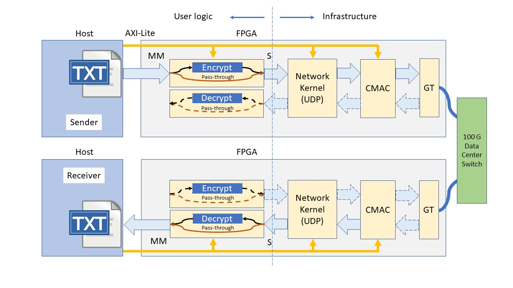
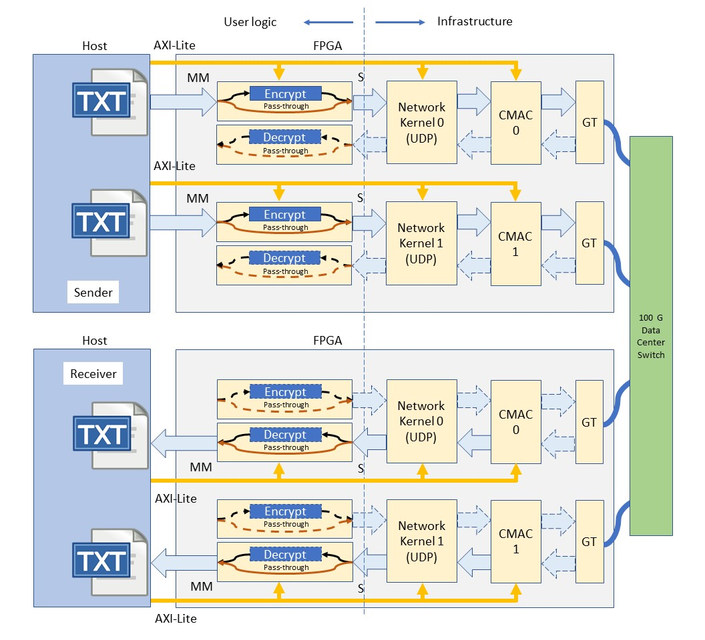
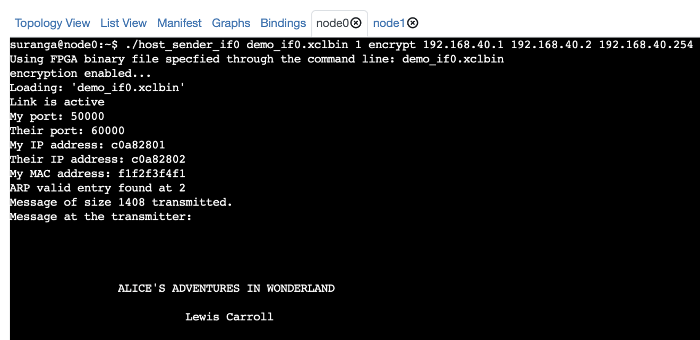
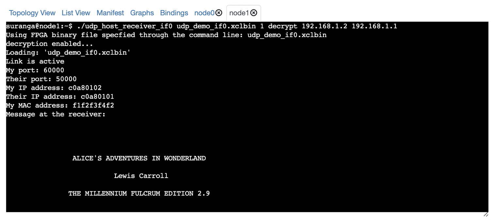

# UDP Encryption and Decryption Example Using 2 Network Attached Alveo U280s

UDP encrypt and decrypt example with pre-built network layer and cmac kernels

## Introduction

In this example, we use Xilinx XUP UDP stack [1] and CMAC kernels as pre-built binary object files (.xo files), and link custom user logic to demonstrate sending and receiving UDP packets between two U280 FPGA accelerator cards. The user logic part has both encryption and decryption kernels implemented using AES-128 block cipher. The AES code used in this example was taken from [2]. OpenCL host applications have also been provided for both sender and receiver. The host code is based on the InAccel runtime [3] and the TCP example in [4]. The sender side host executable is used to read a specific number of packets from a text file. The user can use an AXI-Lite control signal connected to the user logic to either encrypt or directly pass these packets over the network layer and cmac to the receiving host. On the receiver side, the user can read the incoming UDP packets as raw data, or decrypt them.   

## Pre-requisites

- An MOC instance should be created by following [this tutorial](https://github.com/OCT-FPGA/oct-tutorials/blob/master/mocsetup/instancesetup.md). You should select the boot image ```vitis-2020.1-ubuntu-18.04``` when creating the instance.  It is recommended to use VNC server to run through this example. A simple SSH client without VNC access will also work, however if the session gets disconnected unexpectedly in the middle of the bitsteream build, you will have to start over. Instructions on how to get GUI access using VNC and SSH can be found [here](https://github.com/OCT-FPGA/oct-tutorials/blob/master/vncsshsetup/README.md).

- A Cloudlab experiment should be created with two nodes. Instructions are given [here](https://github.com/OCT-FPGA/oct-tutorials/tree/master/cloudlab-setup). Note that you don't need to set up the experiment until you finish bitstream generation. The Cloudlab experiment is only needed for the targeting workflow. This workflow has been tested and verified using Xilinx RunTime (XRT) version 2020.1.1. Other versions may also support, but not tested. So, you may select the Cloudlab profile ```fpga-post-boot``` with any of these tool versions, and two compute nodes when creating the experiment.  

## Architecture



The FPGA bitstream consists of (i) user logic, (ii) UDP stack, and (iii) cmac kernels. The user logic consists of sender and receiver logic which can either encrypt/decrypt or pass-through the incoming data using an AXI-Lite control signal. Network layer (UDP) and cmac are provided as binary files. Therefore, the user will only need to build the user logic, link it with the network layer binary file, and generate a bitstream. Note that sender and receiver bitstreams are identical, and either of the two hosts/FPGAs can be used as the sender/receiver.   

In dual-port send/receive architecture we implement two CMAC, network layer, and user logic units on the FPGA. 


## Clone the repository

First, you should clone the repository using

```git clone https://github.com/OCT-FPGA/network-demo -b 2020.1```

## Build the bitstream and host executable

To configure the environment to run Vitis commands, run the following shell commands.

```bash
source /tools/Xilinx/Vitis/2020.1/settings64.sh
source /opt/xilinx/xrt/setup.sh
```

Also install the package ```libc6-dev-i386```.

```bash
sudo apt install libc6-dev-i386
```

Alveo U280 has two 100 Gbps QSFP-28 ports (port 0 and port 1). It is possible to build a bitstream that uses either of these two to send/receive packets. First, you need to specify the license file location of the CMAC kernel. 

```bash
export XILINXD_LICENSE_FILE=2100@xilinxlicense.massopen.cloud
```

Now you are ready to start building the bitstream. Use the ```make``` command as shown below. You may also pass ```JOBS=<number of jobs>``` as an argument to speed up the build process. The default is 8.

To use port 0:

```make all INTERFACE=0```

To use port 1:

```make all INTERFACE=1```

To use both port 0 and port 1:

```make all INTERFACE=3```

This will create sender and receiver-side host executables and an FPGA bitstream with the logic shown in the figure. The bitstream build process can take up to 4~5 hours depending on the flavor of your MOC instance and the number of jobs that you specified.  

## Copy files to CloudLab

After completing the bitstream generation, You need to copy the bitstream, two host executables, and a text file containing the data to be sent to the two CloudLab nodes.

```bash
scp -i <CloudLab private key> <bitstream> <receiver host executable> <sender host executable> <text file(s)> <user name>@<CloudLab node IP>:<destination directory>
```

Imagine you have created an experiment with CloudLab nodes pc154 and pc157. Copy these files to both nodes.

Example - Single-port:

```bash
scp -i ~/.ssh/cloudlab_openssh ./build_hw_if0/demo_if0.xclbin ./host/build_sw_if0/host_receiver_if0 ./host/build_sw_if0/host_sender_if0 ./host/alice29.txt suranga@pc154.cloudlab.umass.edu:~
```

```bash
scp -i ~/.ssh/cloudlab_openssh ./build_hw_if0/demo_if0.xclbin ./host/build_sw_if0/host_receiver_if0 ./host/build_sw_if0/host_sender_if0 ./host/alice29.txt suranga@pc157.cloudlab.umass.edu:~
```

Example - Dual-port:

```bash
scp -i ~/.ssh/cloudlab_openssh ./build_hw_if3/demo_if3.xclbin ./host/build_sw_if3/host_receiver_if3 ./host/build_sw_if3/host_sender_if3 ./host/alice29.txt ./host/pg66489.txt suranga@pc154.cloudlab.umass.edu:~
```

```bash
scp -i ~/.ssh/cloudlab_openssh ./build_hw_if3/demo_if3.xclbin ./host/build_sw_if3/host_receiver_if3 ./host/build_sw_if3/host_sender_if3 ./host/alice29.txt ./host/pg66489.txt suranga@pc157.cloudlab.umass.edu:~
```

## Run the program

You can now use pc154 as the sender and pc157 as the receiver or vice versa. Be sure to set ```XILINX_XRT``` environment variable on both nodes before you run the application.

```bash
source /opt/xilinx/xrt/setup.sh
```

Run the receiver first.

### Single-port examples

Receiver side syntax:

```bash
./host_receiver_<interface ID> <xclbin> <number of packets> <decrypt or no-decrypt (optional)> <receiver IP (optional)> <sender IP (optional)> <IP gateway (optional)>
```

Example - Receive 1 UDP packet on interface 1 without decrypting

```
./host_receiver_if1 1
```

Sender side syntax:

```bash
./host_sender_<interface ID> <xclbin> <number of packets> <encrypt or no-encrypt (optional)> <sender IP (optional)> <receiver IP (optional)> <IP gateway (optional)> 
```

Example - Send 1 encrypted UDP packet on interface 0

```
./host_sender_if0 1 encrypt
```
### Dual-port examples

Receiver side syntax:

```bash
./host_receiver_if3 <xclbin> <number of packets> <decrypt or no-decrypt (interface 0)(optional)> <decrypt or no-decrypt (interface 1)(optional)> <receiver IP (interface 0)(optional)> <receiver IP (interface 1)(optional)> <sender IP (interface 0)(optional)> <sender IP (interface 1)(optional)> <IP gateway (optional)>
```

Example - Receive 1 UDP packet on each interface without decrypting 

```
./host_receiver_if3 1 1
```

Sender side syntax:

```bash
./host_sender_if3 <xclbin> <number of packets> <encrypt or no-encrypt (interface 0)(optional)> <encrypt or no-encrypt (interface 1)(optional)> <receiver IP (interface 0)(optional)> <receiver IP (interface 1)(optional)> <sender IP (interface 0)(optional)> <sender IP (interface 1)(optional)> <IP gateway (optional)>
```

Example - Send 1 encrypted UDP packet on each interface 
```
./host_sender_if3 1 1 encrypt encrypt
```

Example - Send 1 UDP packet with encryption enabled on interface 1 only
```
./host_sender_if3 1 1 no-encrypt encrypt
```





## References
[1] XUP Vitis Network Example (VNx) https://github.com/Xilinx/xup_vitis_network_example

[2] An HLS Implementation of the Advanced Encryption Standard (AES) http://venividiwiki.ee.virginia.edu/mediawiki/index.php/ToolsXilinxLabsRTLHLSAES

[3] InAccel runtime https://github.com/inaccel/runtime/tree/Xilinx-MP/src/inaccel

[4] Vitis with 100 Gbps TCP/IP Network Stack https://github.com/fpgasystems/Vitis_with_100Gbps_TCP-IP
