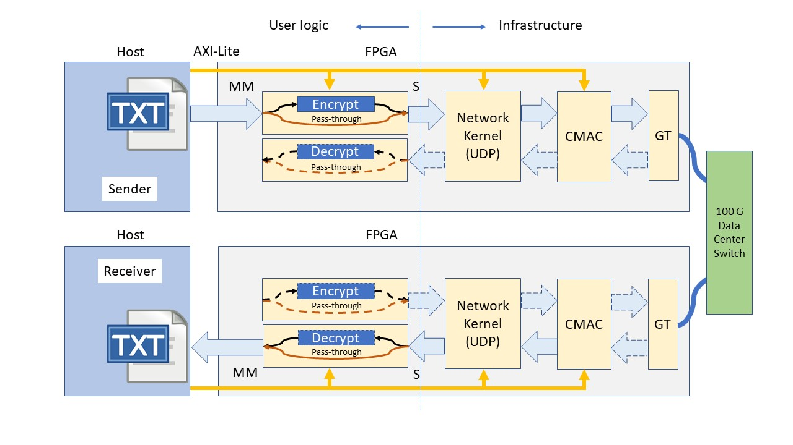
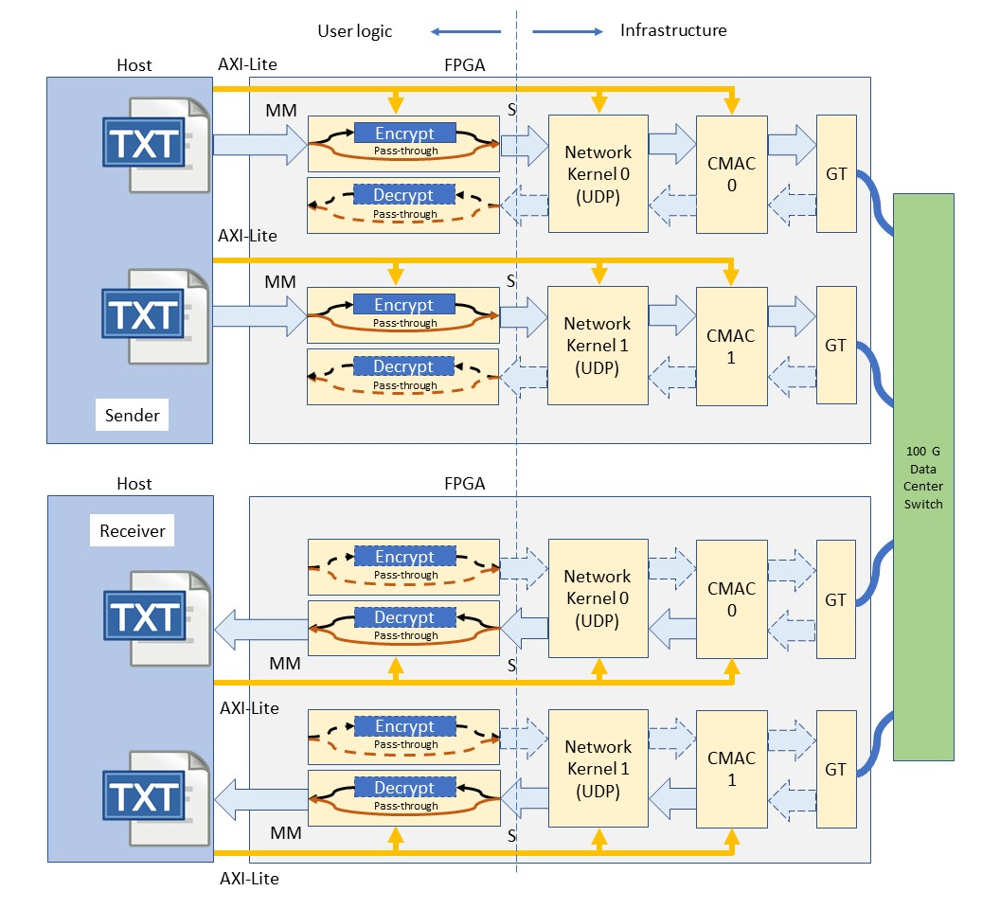
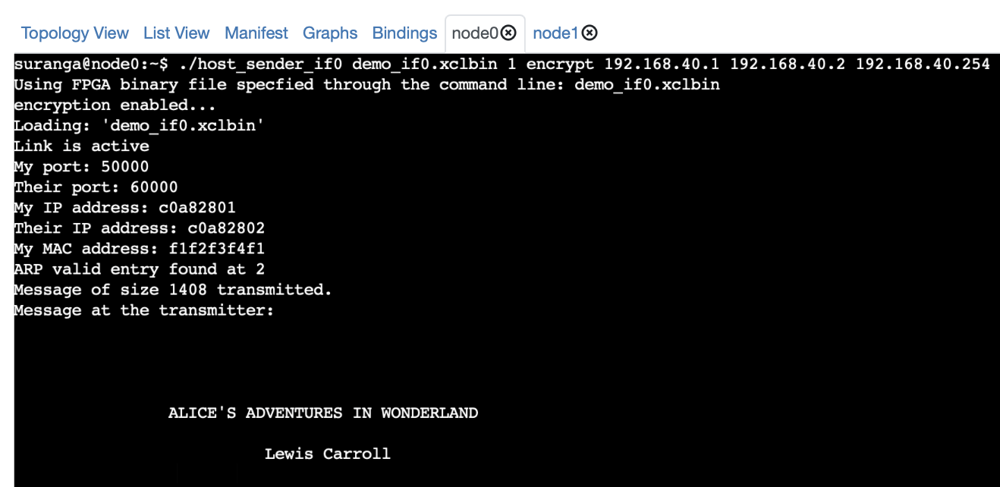
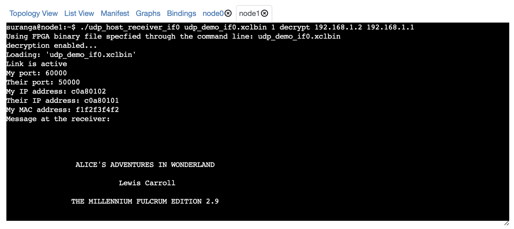

# UDP Encryption and Decryption Example Using 2 Network Attached Alveo U280s

This tutorial demonstrates a UDP encrypt and decrypt example with pre-built network layer and cmac kernels.

## Introduction

In this example, we use Xilinx XUP UDP stack [[1]](#ref1) and CMAC kernels as pre-built binary object files (.xo files), and link custom user logic to demonstrate sending and receiving UDP packets between two U280 FPGA accelerator cards. The user logic part has both encryption and decryption kernels implemented using AES-128 block cipher. The AES code used in this example was taken from [[2]](#ref2). OpenCL host applications have also been provided for both sender and receiver. The host code is based on the InAccel runtime [[3]](#ref3) and the TCP example in [[4]](#ref4). The sender side host executable is used to read a specific number of packets from a text file. The user can use an AXI-Lite control signal connected to the user logic to either encrypt or directly pass these packets over the network layer and cmac to the receiving host. On the receiver side, the user can read the incoming UDP packets as raw data, or decrypt them.   

## Pre-requisites

- A build machine with Vitis 2023.1 installation required. Setup instructions are available [here](https://github.com/OCT-FPGA/OCT-Tutorials/blob/master/cloudlab-setup/build-machines.md). It is recommended to select least 4 CPU cores and 64 GB of RAM for the build machine.

- A CloudLab experiment should be created with two nodes. Instructions can be found [here](https://github.com/OCT-FPGA/OCT-Tutorials/blob/master/cloudlab-setup/fpgas.md). Note that you don't need to set up the experiment until you finish bitstream generation. The CloudLab experiment is only needed for the targeting workflow. This workflow has been tested and verified using Xilinx RunTime (XRT) version 2023.1. Other versions may also support, but have not been tested. Use the CloudLab profile ```oct-u280``` with two compute nodes when creating the experiment.  

## Architecture



The FPGA bitstream consists of (i) user logic, (ii) UDP stack, and (iii) cmac kernels. The user logic consists of sender and receiver logic which can either encrypt/decrypt or pass-through the incoming data using an AXI-Lite control signal. Network layer (UDP) and cmac are provided as binary files. Therefore, the user will only need to build the user logic, link it with the network layer binary file, and generate a bitstream. Note that sender and receiver bitstreams are identical, and either of the two hosts/FPGAs can be used as the sender/receiver.   

In dual-port send/receive architecture we implement two CMAC, network layer, and user logic units on the FPGA. 


## Clone the repository

First, you should clone the repository using

```git clone https://github.com/OCT-FPGA/udp-network-demo```

Then, go to the udp-network-demo directory.

`cd udp-network-demo`

## Build the bitstream and host executable

The build environment is typically pre-configured in this build machine. Run `which vitis` to confirm. 

The Alveo U280 includes two 100 Gbps QSFP-28 ports (port 0 and port 1) to send and receive packets via either or both ports. First, configure the [CMAC license](https://github.com/OCT-FPGA/OCT-Tutorials/blob/master/network-attached-fpga/license_checkout.md). 


Now you are ready to start building the bitstream. Use the ```make``` command as shown below. 

**Note:** Build only one of the following.

To use port 0:

```make all INTERFACE=0```

To use port 1:

```make all INTERFACE=1```

To use both port 0 and port 1:

```make all INTERFACE=3```

This will create sender and receiver-side host executables and an FPGA bitstream with the logic shown in the figure. Expect the build process to take 2 to 3 hours, depending on the number of CPU cores and RAM allocated to the build machine.

## Copy files to shared drive

After generating the bitstream, copy the bitstream, both host executables, and the data text file over to a shared network drive (`/proj/octfpga-PG0`) that the FPGA nodes can access. Be sure to complete this before your build machine session expires.

First, create a directory named with your CloudLab username in `/proj/octfpga-PG0/`

`mkdir /proj/octfpga-PG0/<user name>`

Then copy the files.

`cp <receiver host executable> <sender host executable> <text file(s)> /proj/octfpga-PG0/<user name>`

Example - Single-port sender/receiver:

```bash
cp build_hw_if0/udp_demo_if0.xclbin host/build_sw_if0/udp* host/alice29.txt /proj/octfpga-PG0/<user name>
```

Example - Dual-port sender/receiver:

```bash
cp build_hw_if3/udp_demo_if3.xclbin host/build_sw_if3/udp* host/alice29.txt host/pg66489.txt /proj/octfpga-PG0/<user name>
```

## Run the program

Use one FPGA as the sender and the other as the receiver. For example, use pc154 as the sender and pc155 as the receiver.

Run the receiver (pc155) first.

### Single-port sender/receiver example

First, navigate to the directory where the bitstream and host executables are located. Do this on both nodes. 

`cd /proj/octfpga-PG0/<user name>`

Receiver syntax (pc155 in this example):

`./udp_host_receiver_<interface ID> <xclbin> <number of packets> <decrypt or no-decrypt (optional)> <receiver IP (optional)> <sender IP (optional)> <IP gateway (optional)>`

Example - Receive one UDP packet on interface 0 and perform decryption

`./udp_host_receiver_if0 udp_demo_if0.xclbin 1 decrypt`

Sender syntax (pc154 in this example):

`./udp_host_sender_<interface ID> <xclbin> <number of packets> <encrypt or no-encrypt (optional)> <sender IP (optional)> <receiver IP (optional)> <IP gateway (optional)>`

Example - Send one encrypted UDP packet on interface 0

`./udp_host_sender_if0 udp_demo_if0.xclbin 1 encrypt`

### Dual-port sender/receiver example

Receiver syntax:

```bash
./udp_host_receiver_if3 <xclbin> <number of packets> <decrypt or no-decrypt (interface 0)(optional)> <decrypt or no-decrypt (interface 1)(optional)> <receiver IP (interface 0)(optional)> <receiver IP (interface 1)(optional)> <sender IP (interface 0)(optional)> <sender IP (interface 1)(optional)> <IP gateway (optional)>
```

Example - Receive one UDP packet on each interface without decryption 

`./udp_host_receiver_if3 udp_demo_if3.xclbin 1 1`

Sender syntax:

```bash
./udp_host_sender_if3 <xclbin> <number of packets> <encrypt or no-encrypt (interface 0)(optional)> <encrypt or no-encrypt (interface 1)(optional)> <receiver IP (interface 0)(optional)> <receiver IP (interface 1)(optional)> <sender IP (interface 0)(optional)> <sender IP (interface 1)(optional)> <IP gateway (optional)>
```

Example - Send one encrypted UDP packet on each interface 

`./udp_host_sender_if3 udp_demo_if3.xclbin 1 1 encrypt encrypt`


Example - Send one UDP packet with encryption enabled on interface 1 only

`./udp_host_sender_if3 udp_demo_if3.xclbin 1 1 no-encrypt encrypt`






## References
<a id="ref1"></a>[1] XUP Vitis Network Example (VNx) https://github.com/Xilinx/xup_vitis_network_example

<a id="ref2"></a>[2] AES Implementations https://github.com/hplp/AES_implementations

<a id="ref3"></a>[3] InAccel runtime https://github.com/inaccel/runtime/tree/Xilinx-MP/src/inaccel

<a id="ref4"></a>[4] Vitis with 100 Gbps TCP/IP Network Stack https://github.com/fpgasystems/Vitis_with_100Gbps_TCP-IP
